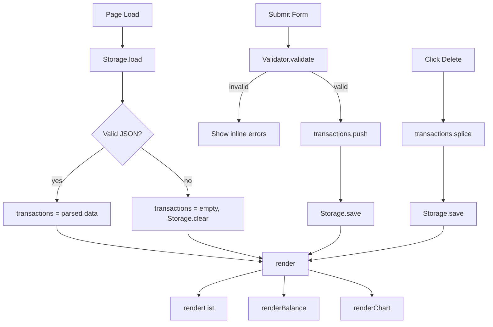

# Design Document: Expense & Budget Visualizer

## Overview

The Expense & Budget Visualizer is a purely client-side single-page application built with vanilla HTML, CSS, and JavaScript. It lets users record expenses, view a running total, and see a pie chart of spending by category. All data is persisted in `localStorage`. There is no backend, no build step, and no framework dependency.

The app ships as three files:
- `index.html` — markup and Chart.js CDN script tag
- `css/styles.css` — all styling
- `js/app.js` — all application logic

Chart.js (v4, loaded from CDN) handles the pie chart rendering.

---

## Architecture

The app follows a simple **state → render** cycle:

```
User Action
    │
    ▼
app.js mutates in-memory state (transactions[])
    │
    ├─► Storage.save()   — persists to localStorage
    │
    └─► render()         — re-renders Transaction_List, Balance_Display, Chart
```

There is no virtual DOM or reactive framework. Every mutation calls a single `render()` function that rebuilds the UI from the current state array. This keeps the logic straightforward and easy to reason about.



---

## Components and Interfaces

### HTML Structure

```
<body>
  <header>
    <h1>Expense & Budget Visualizer</h1>
    <div id="balance-display">Total: $0.00</div>
  </header>

  <main>
    <section id="form-section">
      <form id="input-form">
        <label for="name">Name</label>
        <input id="name" type="text" />
        <span id="error-name" class="error"></span>

        <label for="amount">Amount</label>
        <input id="amount" type="number" min="0.01" step="0.01" />
        <span id="error-amount" class="error"></span>

        <label for="category">Category</label>
        <select id="category">
          <option value="">-- Select --</option>
          <option value="Food">Food</option>
          <option value="Transport">Transport</option>
          <option value="Fun">Fun</option>
        </select>
        <span id="error-category" class="error"></span>

        <button type="submit">Add</button>
      </form>
    </section>

    <section id="chart-section">
      <canvas id="pie-chart"></canvas>
    </section>

    <section id="list-section">
      <ul id="transaction-list"></ul>
    </section>
  </main>
</body>
```

### JavaScript Modules (within app.js)

All logic lives in `js/app.js` as a single IIFE to avoid polluting the global scope. Internal responsibilities are separated by named function groups:

**Storage**
```js
Storage.load()   // returns Transaction[] | []
Storage.save(transactions)  // serializes and writes to localStorage
Storage.clear()  // removes the key
```

**Validator**
```js
Validator.validate(name, amount, category)
// returns { valid: boolean, errors: { name?, amount?, category? } }
```

**Chart controller**
```js
ChartController.init(canvasEl)   // creates Chart.js instance
ChartController.update(transactions)  // recomputes data and calls chart.update()
```

**Render functions**
```js
renderList(transactions)     // rebuilds <ul> innerHTML
renderBalance(transactions)  // updates balance text
render(transactions)         // calls all three render functions
```

**Event handlers**
- `form.addEventListener('submit', onSubmit)`
- `list.addEventListener('click', onDeleteClick)` — event delegation

---

## Data Models

### Transaction

```js
/**
 * @typedef {Object} Transaction
 * @property {string} id        - UUID v4 (crypto.randomUUID())
 * @property {string} name      - Non-empty display name
 * @property {number} amount    - Positive float, stored as number
 * @property {string} category  - One of: "Food" | "Transport" | "Fun"
 */
```

### In-memory state

```js
let transactions = []; // Transaction[]
```

### localStorage schema

- Key: `"expense_transactions"`
- Value: JSON-serialized `Transaction[]`

Example:
```json
[
  { "id": "abc-123", "name": "Lunch", "amount": 12.50, "category": "Food" },
  { "id": "def-456", "name": "Bus pass", "amount": 30.00, "category": "Transport" }
]
```

### Validation rules

| Field    | Rule                                      |
|----------|-------------------------------------------|
| name     | Non-empty after trim                      |
| amount   | Parseable as float, value > 0             |
| category | One of "Food", "Transport", "Fun"         |

### Chart data shape (passed to Chart.js)

```js
{
  labels: ["Food", "Transport", "Fun"],   // only categories with amount > 0
  datasets: [{
    data: [45.00, 30.00, 20.00],          // sum per category
    backgroundColor: ["#FF6384", "#36A2EB", "#FFCE56"]
  }]
}
```

---

